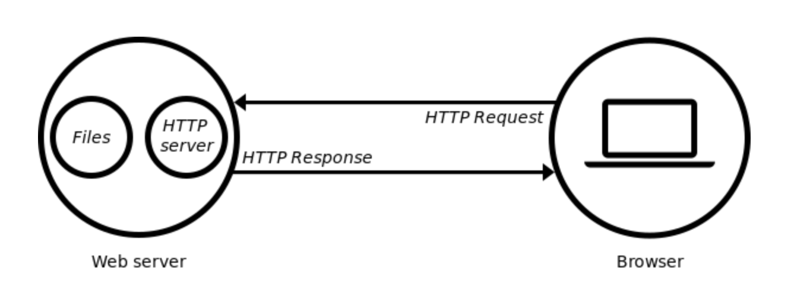

# CppHTTP

## Idea
Personal project to build an HTTP web server from scratch in C++, using only the standard library

## Concepts
### HTTP Server
Hypertext Transfer Protocol. Protocol for sending/receiving data over the internet.
Server is a computer that serves data over a network via HTTP.

### Web Client
A wider term that encompasses both web browsers and web applications.

### HTTP Request/Response
Web server is powered by HTTP server :
1) receives request and process it
2) determines response after checking
3) sends response to web  client (may include data, e.g. HTML stored on webserver)

### TCP
Connection-based protocol used for HTTP servers. It guarantees the integrity of the data being communicated over a network (compared to UDP which is connectionless).

### Ports & Sockets
- TCP Socket is an endpoint *instance* defined by *IP address* and a *port*. Used in context of a TCP connection or a listening state. Ports differentiate multiple endpoints on a given network address.
- TCP *connection* is defined by two endpoints aka sockets.
- Port is a virtualisation identifier defining a service endpoint (vs a service instance endpoint which is a session identifier). Makes multiple concurrent connections on a single network interface possible.
- TCP socket is not a connection, but endpoint of a specific connection.
- Can be concurrent connections to a service endpoint, but *only one* listener socket for a given address/port combination.

#### TLDR: 

A **socket** (e.g. 10.1.1.2, tcp, port1030) consists of
  1) An IP address
  2) A transport protocol
  3) A port number

A **port** (e.g. 1030) is between 1 and 65535 inclusive, and is a logical gate in a device. Every connnection between client/server requires a unique socket.

     

